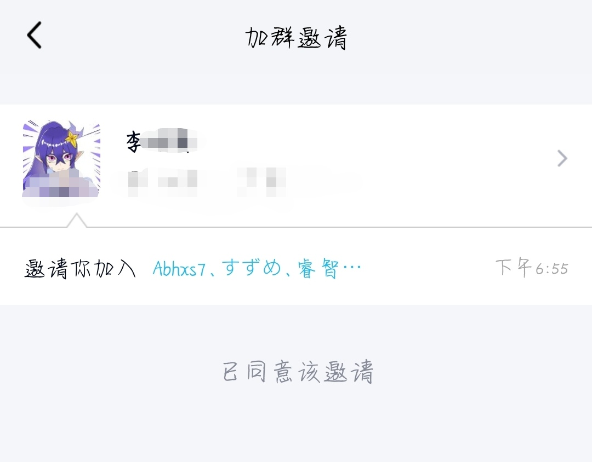

### 去你大爷的自动同意入群

**由于使用机器人容易导致账号冻结（比如非常用设备登录），不推荐使用**

========================

**基于 QQ 机器人 协议(使用 cicqq)，因此使用会看到"手表版QQ已登录"**

无法禁止自动同意好友邀请入群，对于很多人来说是很大的困扰。

尤其对于一些加了不明好友的人，被随意拉进群，而且没有提醒，没有经过同意，想必都不能接受。

其实，我们没有同意，是 QQ 的服务器，自动同意的。


选择权，不在用户。你只有使用权。



因此我写了这个脚本，自动退群。

效果如下


由于 icqq(基于 oicq) 的一些特性，所以能在部分情况下重新连上网络后处理未自动退群的事件。

但是不能保证这个特性能正常，作者仅模拟切断WIFI后十秒被拉入群的情况，请各位酌情使用。

建议保持运行以获得最佳体验。

**脚本依赖 icqq ，使用 Node.js 启动，因为腾讯的尿性，因此不能保证 icqq 机器人协议能永久使用！**

#### 使用

安装 Node.js

安装 icqq(要cd到 fuck_qq_auto_group.js 所在目录)

```shell
npm install icqq
```

下载本仓库里的 fuck_qq_auto_group.js 文件，然后在你的终端执行下面的命令：

```shell
node fuck_qq_auto_group 你的QQ号 你的QQ账号密码
```

默认使用手表协议，若无法登录，请尝试更换协议(见 oicq 文档的 api 项，底部列出了常用协议，但大多被和谐了)

#### 已知问题

由于依赖于检测 入群事件 ，因此会导致建群/自主入群失败(表现：入群后自动退群)。

若介意者，请勿使用此脚本。
